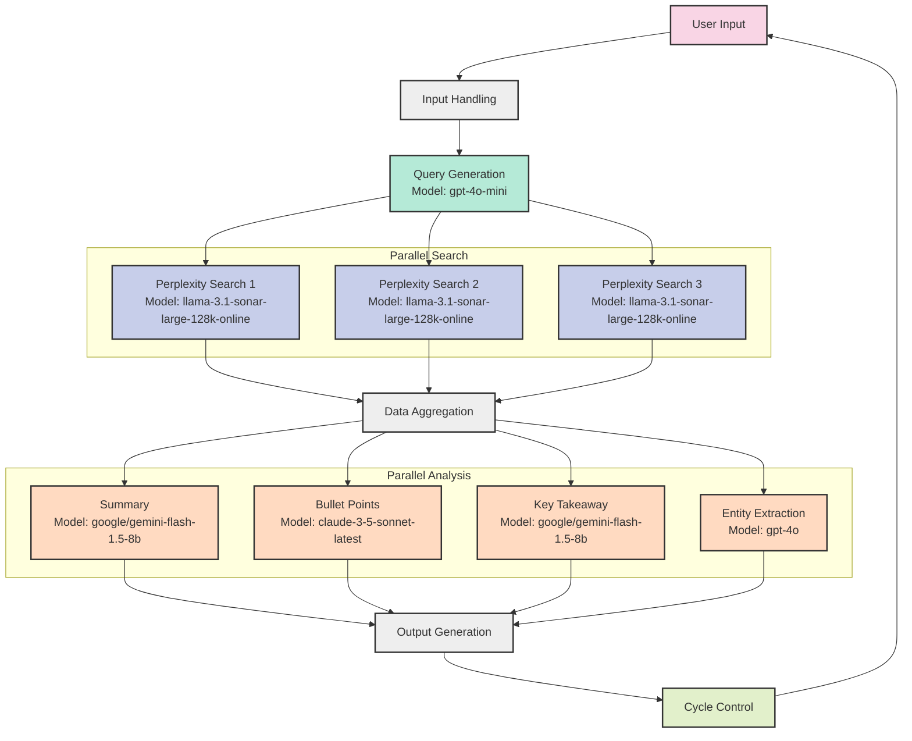

# The Last Centaur - Agent Workflow

```mermaid
flowchart TD
    A[User Input] --> B[Input Handling]
    B --> C[Query Generation\nModel: gpt-4o-mini]
    C --> D1[Perplexity Search 1\nModel: llama-3.1-sonar-large-128k-online]
    C --> D2[Perplexity Search 2\nModel: llama-3.1-sonar-large-128k-online]
    C --> D3[Perplexity Search 3\nModel: llama-3.1-sonar-large-128k-online]

    subgraph "Parallel Search"
    D1
    D2
    D3
    end

    D1 --> E[Data Aggregation]
    D2 --> E
    D3 --> E

    E --> F1[Summary\nModel: google/gemini-flash-1.5-8b]
    E --> F2[Bullet Points\nModel: claude-3-5-sonnet-latest]
    E --> F3[Key Takeaway\nModel: google/gemini-flash-1.5-8b]
    E --> F4[Entity Extraction\nModel: gpt-4o]

    subgraph "Parallel Analysis"
    F1
    F2
    F3
    F4
    end

    F1 --> G[Output Generation]
    F2 --> G
    F3 --> G
    F4 --> G

    G --> H[Cycle Control]
    H --> A

    style A fill:#f9d5e5,stroke:#333,stroke-width:2px
    style B fill:#eeeeee,stroke:#333,stroke-width:2px
    style C fill:#b5ead7,stroke:#333,stroke-width:2px
    style D1 fill:#c7ceea,stroke:#333,stroke-width:2px
    style D2 fill:#c7ceea,stroke:#333,stroke-width:2px
    style D3 fill:#c7ceea,stroke:#333,stroke-width:2px
    style E fill:#eeeeee,stroke:#333,stroke-width:2px
    style F1 fill:#ffdac1,stroke:#333,stroke-width:2px
    style F2 fill:#ffdac1,stroke:#333,stroke-width:2px
    style F3 fill:#ffdac1,stroke:#333,stroke-width:2px
    style F4 fill:#ffdac1,stroke:#333,stroke-width:2px
    style G fill:#eeeeee,stroke:#333,stroke-width:2px
    style H fill:#e2f0cb,stroke:#333,stroke-width:2px
```
